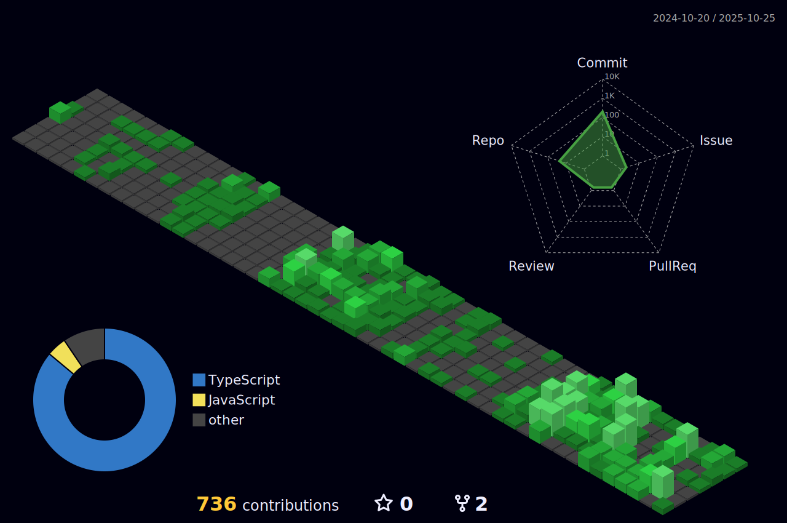

<h2> Hi, I'm Zuhayr! </h2>


### Full-stack Web Developer 

[](https://www.linkedin.com/in/zuhayrtariq/)
[](https://github.com/zuhayrtariq)


### About me...  

```javascript
const zuhayr = {
  nationality : "Pakistani"
  code: [Javascript, Typescript, NextJS, ReactJS, NodeJS],
  tools: [TailwindCSS, ShadCN, MongoDB, SQL],
  architecture: ["microservices", "event-driven", "design system pattern"],
  sports : ["cricket","table tennis", "tennis","chess"],
  portfolio : "https://zuhayr.vercel.app"
}
```

